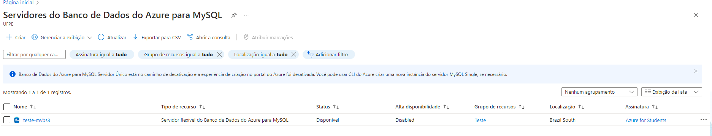
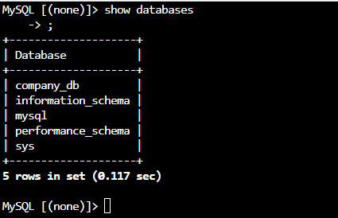
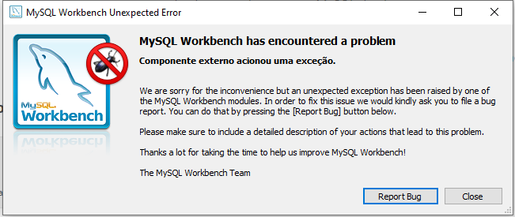
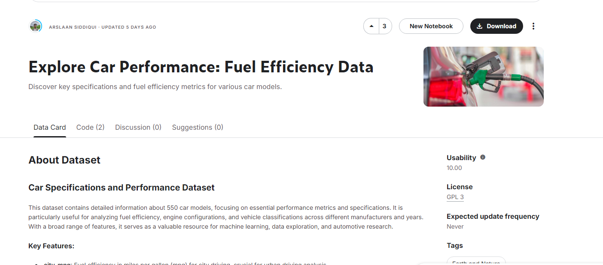
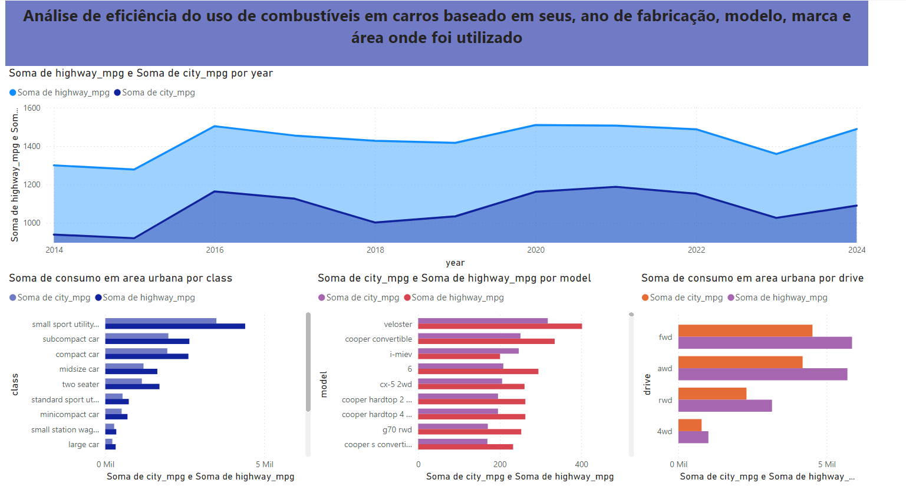

# cloud_azure_BI

Criado para realizacao do desafio de cloud da DIO

Durante o desafio eu percebi várias e várias inconsistências nele, a parte mais difícil do desafio se dava na parte de criar e povoar o banco de dados. É necessária uma revisão nos comandos SQL utilizados nessa etapa, pois eles estão completamente quebrados, com referências erradas e o povoamento acaba não funcionando.
Sendo assim após criar meu db na azure:

Eu resolvi utilizar o meu proprio banco de dados e eu mesmo o povoei:

Porém tem algum bug no meu mySQL workbanch que fez com que eu nao consneguisse utilizar a cloud como servidor:

Apesar de eu nao ter conseugido utiliazr a cloud como eu gostaria, eua prendi e entendi bem como utiliza-la, por isso pra finalizar a tarefa eu peguei um novo dataset no kagle e o analisei!:

e assim ficou minha anlise sobre uso de combustiveis tanto ema reas urbanas como areas offroad:

Foi necessário ter q fazer algo diferente para poder fianlizar esse desafio, senão eu ficaria preso nele!
